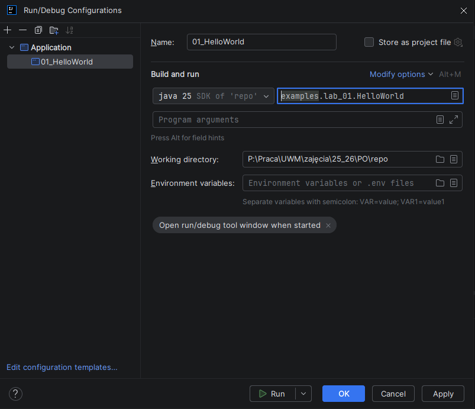

# **Programowanie Obiektowe – Java (2026Z)**

## **Lab 1: Organizacja zajęć, środowisko Java i modelowanie obiektowe**

---

## 1. Cel zajęć

Celem pierwszych zajęć jest przygotowanie środowiska pracy, przypomnienie najważniejszych podstaw języka Java oraz wprowadzenie do sposobu myślenia charakterystycznego dla programowania obiektowego.

Po zakończeniu zajęć osoba studencka powinna:

* potrafić utworzyć, skompilować i uruchomić prosty program w języku Java,
* rozumieć podstawową rolę JDK, kompilatora `javac` oraz maszyny wirtualnej JVM,
* znać podstawową strukturę programu w Javie,
* swobodnie korzystać z podstawowych konstrukcji języka: zmiennych, instrukcji warunkowych i pętli,
* potrafić odczytywać dane z konsoli i wyświetlać wyniki,
* potrafić analizować i poprawiać prosty istniejący kod,
* rozumieć pojęcia **obiektu**, **klasy**, **stanu**, **zachowania** i **abstrakcji**,
* potrafić wskazać potencjalne obiekty, ich właściwości i odpowiedzialności na podstawie opisu rzeczywistego problemu.

> **Uwaga:** te zajęcia nie stanowią pełnego kursu podstaw języka Java.  
> Podstawowa składnia języka jest materiałem do samodzielnego przypomnienia. Na kolejnych zajęciach zakładana będzie jej znajomość.

---

# 2. Java – od kodu źródłowego do programu

Java jest językiem programowania **zorientowanym obiektowo** i statycznie typowanym.

Kod źródłowy zapisujemy w plikach z rozszerzeniem `.java`.

W klasycznym procesie uruchamiania programu:

1. programista zapisuje kod źródłowy,
2. kompilator `javac` kompiluje go do kodu bajtowego (*bytecode*),
3. powstaje plik `.class`,
4. maszyna wirtualna Javy (**JVM**) wykonuje kod bajtowy.

```text
kod źródłowy .java
        ↓
      javac
        ↓
bytecode .class
        ↓
       JVM
        ↓
uruchomiony program
```

Dzięki wykorzystaniu JVM ten sam skompilowany kod może być wykonywany na różnych systemach operacyjnych posiadających odpowiednie środowisko Javy.

---

## 2.1. JDK i JVM

### JVM – Java Virtual Machine

JVM jest maszyną wirtualną odpowiedzialną za wykonywanie kodu bajtowego Javy.

### JDK – Java Development Kit

JDK zawiera narzędzia potrzebne do tworzenia programów w Javie, między innymi:

* kompilator `javac`,
* program `java` służący do uruchamiania aplikacji,
* standardowe biblioteki języka,
* narzędzia pomocnicze dla programistów.

Na komputerze wykorzystywanym do programowania powinno być zainstalowane **JDK**, a nie jedynie środowisko pozwalające uruchamiać gotowe aplikacje.

Wersję zainstalowanej Javy można sprawdzić w terminalu:

```bash
java --version
```

oraz:

```bash
javac --version
```

---

# 3. Pierwszy program

Na zajęciach będziemy korzystali z klasycznej struktury programu Java.

```java
public class Main {

    public static void main(String[] args) {
        System.out.println("Hello, Java!");
    }
}
```

Metoda:

```java
public static void main(String[] args)
```

stanowi punkt wejścia do programu.

Znaczenie poszczególnych elementów `public`, `static`, klas oraz metod będzie dokładniej omawiane na kolejnych zajęciach. Na tym etapie należy przede wszystkim potrafić rozpoznać podstawową strukturę programu i go uruchomić.

---

## 3.1. Kompilacja z terminala

Jeżeli plik nazywa się:

```text
Main.java
```

możemy go skompilować poleceniem:

```bash
javac Main.java
```

Po poprawnej kompilacji powstanie:

```text
Main.class
```

Program uruchamiamy:

```bash
java Main
```

---

# 4. IntelliJ IDEA

Zalecanym środowiskiem wykorzystywanym podczas zajęć jest **IntelliJ IDEA**.

Korzystanie z tego środowiska nie jest obowiązkowe, jednak przykłady prezentowane podczas zajęć mogą być wykonywane właśnie w IntelliJ IDEA.

## Utworzenie projektu

W IntelliJ IDEA:

1. wybierz **New Project**,
2. jako język wybierz **Java**,
3. wskaż zainstalowane JDK,
4. utwórz projekt,
5. utwórz klasę `Main`,
6. dodaj metodę `main`,
7. uruchom program.

Można też skompilować i od razu uruchomić kod z pliku `.java` używając konfuguracji projektu w IDE IntelliJ. Aby to zrobić kliknij
u góry IntelliJ'a delikatnie po prawej *Edit Configurations* --> *Add new* --> *Application*, a następnie wybrac plik, który zawiera *main*'a:



Następnie uruchomić plik z przycisku bądź skrótem klawiszowym `CTRL + F5`.

W najprostszym przypadku:

```java
public class Main {

    public static void main(String[] args) {
        System.out.println("Program działa.");
    }
}
```

---

# 5. Szybkie przypomnienie podstaw Javy

Poniższa część stanowi jedynie **ściągę przypominającą**. Poszczególne zagadnienia będą podane w folderze "dodatkowe" w repozytorium jak i podane w minikursie języka Java podanym na wykładzie lub zostać samodzielnie uzupełnione.

---

## 5.1. Zmienne i podstawowe typy danych

Przykładowe typy proste:

```java
int liczba = 10;
long duzaLiczba = 10_000_000_000L;
double temperatura = 21.5;
char znak = 'A';
boolean aktywny = true;
```

Tekst przechowujemy między innymi przy użyciu klasy `String`:

```java
String imie = "Jan";
```

Java jest językiem **statycznie typowanym** – typ zmiennej jest określany podczas kompilacji.

---

## 5.2. Wyjście na konsolę

```java
System.out.println("Hello!");
```

```java
int wynik = 42;

System.out.println("Wynik: " + wynik);
```

Możemy również używać formatowania:

```java
String imie = "Anna";
int wiek = 21;

System.out.printf("%s ma %d lat.%n", imie, wiek);
```

---

## 5.3. Dane od użytkownika

Do prostego odczytu danych z konsoli można wykorzystać klasę `Scanner`.

```java
import java.util.Scanner;

public class Main {

    public static void main(String[] args) {
        Scanner scanner = new Scanner(System.in);

        System.out.print("Podaj imię: ");
        String imie = scanner.nextLine();

        System.out.print("Podaj wiek: ");
        int wiek = scanner.nextInt();

        System.out.printf("%s ma %d lat.%n", imie, wiek);

        scanner.close();
    }
}
```

Najczęściej wykorzystywane metody:

| Metoda | Odczytywane dane |
|---|---|
| `nextInt()` | liczba całkowita |
| `nextDouble()` | liczba zmiennoprzecinkowa |
| `next()` | pojedyncze słowo |
| `nextLine()` | cały wiersz |
| `nextBoolean()` | `true` lub `false` |

---

## 5.4. Instrukcje warunkowe

```java
if (wiek >= 18) {
    System.out.println("Osoba pełnoletnia.");
} else {
    System.out.println("Osoba niepełnoletnia.");
}
```

Kilka warunków:

```java
if (punkty >= 90) {
    System.out.println("Bardzo dobry wynik");
} else if (punkty >= 50) {
    System.out.println("Zaliczenie");
} else {
    System.out.println("Brak zaliczenia");
}
```

Operator trójargumentowy:

```java
String wynik = wiek >= 18 ? "pełnoletni" : "niepełnoletni";
```

---

## 5.5. `switch`

Jeżeli sprawdzamy kilka możliwych wartości tej samej zmiennej, możemy wykorzystać `switch`.

```java
int opcja = 2;

switch (opcja) {
    case 1:
        System.out.println("Dodawanie");
        break;

    case 2:
        System.out.println("Odejmowanie");
        break;

    default:
        System.out.println("Nieznana opcja");
}
```

---

## 5.6. Pętle

### `for`

```java
for (int i = 0; i < 5; i++) {
    System.out.println(i);
}
```

### `while`

```java
int i = 0;

while (i < 5) {
    System.out.println(i);
    i++;
}
```

### `do-while`

```java
int i = 0;

do {
    System.out.println(i);
    i++;
} while (i < 5);
```

---

## 5.7. Tablice

```java
int[] liczby = {4, 7, 2, 9, 1};
```

Dostęp do pojedynczego elementu:

```java
System.out.println(liczby[0]);
```

Iteracja:

```java
for (int liczba : liczby) {
    System.out.println(liczba);
}
```

Liczba elementów:

```java
System.out.println(liczby.length);
```

---

# 6. Od programowania proceduralnego do obiektowego

Do tej pory program można było traktować przede wszystkim jako zestaw instrukcji:

```text
pobierz dane
    ↓
wykonaj obliczenia
    ↓
sprawdź warunki
    ↓
wyświetl wynik
```

W programowaniu obiektowym zaczynamy patrzeć na problem inaczej.

Zastanawiamy się:

> **Jakie elementy występują w modelowanym problemie i za co powinny odpowiadać?**

---

# 7. Obiekt

**Obiekt** reprezentuje konkretny element modelowanego świata.

Przykładowo w systemie bibliotecznym mogą istnieć:

* książka,
* czytelnik,
* bibliotekarz,
* wypożyczenie.

W systemie sklepu internetowego:

* produkt,
* klient,
* koszyk,
* zamówienie,
* płatność.

Obiekt posiada przede wszystkim:

**stan** – dane opisujące obiekt,

oraz

**zachowanie** – operacje, które może wykonywać.

---

## Przykład

Rozważmy samochód.

### Stan

Samochód może posiadać:

```text
marka
model
rokProdukcji
predkosc
iloscPaliwa
```

### Zachowanie

Samochód może:

```text
uruchomicSilnik()
przyspiesz()
hamuj()
zatankuj()
```

Zamiast przechowywać wszystkie dane i funkcje programu niezależnie od siebie, możemy pogrupować je według odpowiedzialności konkretnych obiektów.

---

# 8. Klasa a obiekt

**Klasa** opisuje pewien rodzaj obiektów.

Możemy traktować ją jako definicję tego:

* jakie dane posiada obiekt,
* jakie operacje można na nim wykonywać.

Przykładowo:

```text
Klasa: Samochod

stan:
- marka
- model
- predkosc

zachowanie:
- przyspiesz()
- hamuj()
```

Na podstawie jednej klasy możemy utworzyć wiele różnych obiektów:

```text
Samochod #1
marka = Toyota
model = Corolla

Samochod #2
marka = Ford
model = Mustang
```

Dokładna implementacja klas i obiektów w Javie będzie tematem **Lab 2**.

---

# 9. Abstrakcja

Jednym z podstawowych elementów modelowania obiektowego jest **abstrakcja**.

Abstrakcja polega na wybraniu tych cech danego obiektu, które są istotne z punktu widzenia tworzonego programu, oraz pominięciu pozostałych.

Nie próbujemy odwzorować całej rzeczywistości.

---

## Przykład

Jeżeli tworzymy system wypożyczalni samochodów, samochód może posiadać:

```text
marka
model
numerRejestracyjny
cenaZaDobe
statusWypozyczenia
```

Prawdopodobnie nie interesują nas natomiast:

```text
kolor śrub mocujących silnik
numer seryjny radia
grubość lakieru na masce
```

chyba że wymagania konkretnego systemu mówią inaczej.

> Nie istnieje jeden uniwersalny model obiektu.  
> Model zależy od problemu, który próbujemy rozwiązać.

---

# 10. Odpowiedzialność obiektu

Podczas projektowania należy zastanawiać się nie tylko:

> Jakie dane powinien posiadać obiekt?

ale również:

> **Za co powinien odpowiadać?**

Rozważmy prosty system bankowy.

Obiekt:

```text
KontoBankowe
```

może przechowywać:

```text
numer rachunku
saldo
waluta
```

oraz odpowiadać za:

```text
wpłatę pieniędzy
wypłatę pieniędzy
sprawdzenie salda
```

Natomiast wysłanie wiadomości e-mail do klienta prawdopodobnie nie powinno należeć do odpowiedzialności samego konta bankowego.

Umiejętność właściwego podziału odpowiedzialności pomiędzy obiekty jest jednym z najważniejszych elementów projektowania obiektowego.

---

# 11. Pierwszy model

Rozważmy system biblioteczny.

Opis:

> Biblioteka przechowuje książki. Każda książka posiada tytuł, autora oraz numer ISBN. Czytelnik może wypożyczyć książkę. System powinien również przechowywać informację o tym, kiedy książka została wypożyczona i kiedy powinna zostać zwrócona.

Możemy wskazać potencjalne klasy:

```text
Ksiazka
Czytelnik
Wypozyczenie
```

### `Ksiazka`

Stan:

```text
tytul
autor
isbn
```

### `Czytelnik`

Stan:

```text
imie
nazwisko
numerKarty
```

### `Wypozyczenie`

Stan:

```text
ksiazka
czytelnik
dataWypozyczenia
terminZwrotu
```

Już na tym etapie można zauważyć, że obiekty mogą być ze sobą **powiązane**.

Szczegółowe sposoby implementowania takich zależności poznamy podczas kolejnych zajęć.

---

# 12. Czytanie i analizowanie kodu

W trakcie tego przedmiotu ważna będzie nie tylko umiejętność napisania programu od początku.

Równie istotne jest:

* czytanie istniejącego kodu,
* przewidywanie wyniku programu,
* lokalizowanie błędów,
* uzupełnianie brakujących fragmentów,
* poprawianie kodu,
* później również jego refaktoryzacja.

Przykład:

```java
public class Main {

    public static void main(String[] args) {
        int suma = 0;

        for (int i = 1; i <= 5; i++) {
            suma += i;
        }

        System.out.println(suma);
    }
}
```

Przed uruchomieniem programu spróbuj odpowiedzieć:

1. Ile razy wykona się pętla?
2. Jakie wartości będzie kolejno przyjmować `i`?
3. Jak zmienia się `suma`?
4. Jaki będzie wynik programu?

Dopiero później uruchom kod i sprawdź odpowiedź.

---

# 13. Typowe błędy

## Brak średnika

```java
int liczba = 10
```

## Użycie niezainicjalizowanej zmiennej

```java
int liczba;

System.out.println(liczba);
```

## Niewłaściwy warunek pętli

```java
for (int i = 0; i >= 10; i++) {
    System.out.println(i);
}
```

Pętla nie wykona się ani razu.

## Nieskończona pętla

```java
int i = 0;

while (i < 10) {
    System.out.println(i);
}
```

Wartość `i` nigdy się nie zmienia.

## Wyjście poza zakres tablicy

```java
int[] liczby = {1, 2, 3};

System.out.println(liczby[3]);
```

Indeksy tej tablicy to:

```text
0, 1, 2
```

---

# **Zadania**

## Zadanie 1. Przygotowanie środowiska i repozytorium

1. Sprawdź działanie JDK:

```bash
java --version
javac --version
```

2. Utwórz projekt Java w wybranym środowisku programistycznym.

3. Utwórz program:

```java
public class Main {

    public static void main(String[] args) {
        System.out.println("Programowanie Obiektowe 2026Z");
    }
}
```

4. Uruchom program.

5. Utwórz repozytorium przeznaczone na rozwiązania zadań z przedmiotu.

6. Zaproś prowadzącego do repozytorium zgodnie z informacją przekazaną podczas zajęć.

7. Utwórz strukturę umożliwiającą przechowywanie rozwiązań osobno dla kolejnych laboratoriów.

Przykładowo:

```text
lab_01/
lab_02/
lab_03/
...
```

Do repozytorium **nie należy dodawać plików skompilowanych ani katalogów generowanych automatycznie przez IDE**.

---

## Zadanie 2. Diagnostyka – podstawy języka

Napisz program pobierający od użytkownika dodatnią liczbę całkowitą `n`.

Program powinien wyświetlić:

* czy liczba jest parzysta,
* czy jest podzielna przez `3`,
* sumę liczb od `1` do `n`,
* liczbę wszystkich liczb parzystych z przedziału od `1` do `n`.

Przykładowe wejście:

```text
Podaj n: 8
```

Przykładowe wyjście:

```text
Liczba jest parzysta.
Liczba nie jest podzielna przez 3.
Suma: 36
Liczb parzystych: 4
```

Nie używaj gotowych kolekcji.

---

## Zadanie 3. Analiza danych

Napisz program, który wczytuje od użytkownika **10 liczb całkowitych** do tablicy.

Następnie program powinien wyświetlić:

* największą wartość,
* najmniejszą wartość,
* sumę wszystkich elementów,
* średnią arytmetyczną,
* liczbę wartości większych od średniej.

Nie korzystaj z gotowych metod wyszukujących minimum lub maksimum.

---

## Zadanie 4. Napraw kod

Poniższy program zawiera kilka błędów.

```java
import java.util.Scanner;

public class Main {

    public static void main(String[] args) {
        Scanner scanner = new Scanner(System.in)

        System.out.print("Podaj liczbę: ");
        int liczba = scanner.nextInt();

        if (liczba % 2 = 0) {
            System.out.println("Liczba jest parzysta");
        }
        else {
            System.out.println("Liczba jest nieparzysta")
        }

        for (int i = 0; i <= 5; i--) {
            System.out.println(i);
        }

        scanner.close();
    }
}
```

1. Znajdź wszystkie błędy uniemożliwiające poprawne działanie programu.
2. Popraw program.
3. Dla każdego błędu wyjaśnij, na czym polegał.
4. Określ, które błędy wykrywa kompilator, a które mogą ujawnić się dopiero podczas działania programu.

---

## Zadanie 5. Przewidywanie wyniku programu

Bez uruchamiania kodu określ wynik poniższego programu:

```java
public class Main {

    public static void main(String[] args) {
        int x = 2;
        int wynik = 0;

        for (int i = 0; i < 4; i++) {
            wynik += x;
            x *= 2;
        }

        System.out.println(x);
        System.out.println(wynik);
    }
}
```

Zapisz kolejne wartości `i`, `x` i `wynik` w postaci tabeli.

Dopiero po przygotowaniu odpowiedzi uruchom program i zweryfikuj wynik.

---

## Zadanie 6. Modelowanie – biblioteka

Nie implementuj jeszcze klas w Javie.

Przeanalizuj następujący opis:

> Tworzony jest system obsługi biblioteki. Biblioteka posiada książki. Każda książka ma tytuł, autora, ISBN oraz rok wydania. Z biblioteki korzystają czytelnicy posiadający imię, nazwisko oraz numer karty bibliotecznej. Czytelnik może wypożyczyć książkę. System musi pamiętać datę wypożyczenia oraz termin zwrotu.

Zaproponuj klasy występujące w systemie.

Dla każdej klasy określ:

1. jej nazwę,
2. dane, które powinna przechowywać,
3. jej podstawowe odpowiedzialności.

Przykładowa forma odpowiedzi:

```text
Klasa: ....................

Stan:
- ....................
- ....................

Odpowiedzialności:
- ....................
- ....................
```

Następnie określ, jakie zależności występują pomiędzy zaproponowanymi obiektami.

---

## Zadanie 7. Modelowanie – własny przykład

Wybierz **jeden** z poniższych systemów:

* sklep internetowy,
* kino,
* wypożyczalnia samochodów,
* system rezerwacji hotelowej,
* uczelnia,
* komunikator internetowy.

Wskaż co najmniej **4 potencjalne klasy**.

Dla każdej określ:

* najważniejsze dane,
* podstawowe odpowiedzialności.

Następnie odpowiedz:

1. Które obiekty powinny wiedzieć o istnieniu innych obiektów?
2. Czy któraś odpowiedzialność została przypisana do niewłaściwego obiektu?
3. Które informacje z rzeczywistego świata świadomie pomijasz w swoim modelu?
4. Dlaczego ich nie potrzebujesz?

---

## Zadanie 8. Abstrakcja

Rozważ obiekt **Samochód** w trzech różnych programach:

### A. System wypożyczalni samochodów

### B. Gra wyścigowa

### C. System warsztatu samochodowego

Dla każdego systemu zaproponuj zestaw informacji, które powinien przechowywać obiekt `Samochod`.

Przykładowo cecha:

```text
numerRejestracyjny
```

może być bardzo istotna dla wypożyczalni, a jednocześnie całkowicie niepotrzebna w prostej grze wyścigowej.

Odpowiedz:

> Dlaczego nie istnieje jedna „poprawna” klasa `Samochod` pasująca do każdego programu?

---

# **Zadanie dodatkowe**

Napisz program, który pobiera od użytkownika dodatnią liczbę całkowitą i wyświetla ją w odwrotnej kolejności.

Przykład:

```text
Podaj liczbę: 123450
Odwrócona liczba: 54321
```

Nie konwertuj liczby na `String`.

---

# **Po zajęciach**

Jeżeli wykonanie zadań 2–5 sprawiało trudność, przed kolejnymi zajęciami należy powtórzyć w szczególności:

* typy danych i zmienne,
* operatory arytmetyczne i logiczne,
* `if` / `else`,
* `switch`,
* pętle `for`, `while`, `do-while`,
* tablice,
* podstawowe operacje wejścia i wyjścia.

Na **Lab 2** zakładana będzie znajomość tych elementów.

Kolejne zajęcia będą poświęcone właściwej implementacji **klas i obiektów w języku Java**.